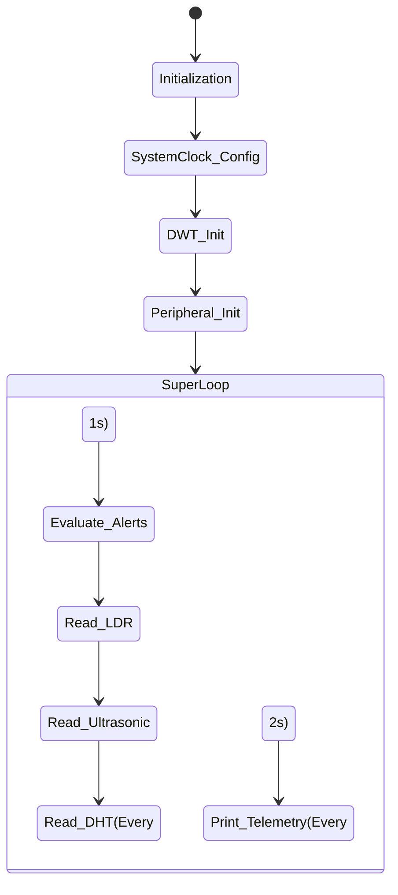

# System Architecture

This document describes the firmware flow and hardware abstraction for the STM32 Multi-Sensor system.

## High-Level Software Flow
The firmware utilizes a bare-metal super-loop architecture. All sensor readings are polled sequentially, avoiding the overhead of an RTOS while maintaining strict timing constraints using the ARM Cortex-M Data Watchpoint and Trace (DWT) cycle counter.



## DWT Timing Mechanism
Standard `HAL_Delay` provides millisecond resolution relying on the SysTick interrupt. For protocols requiring 10-50µs resolution (like HC-SR04 and DHT11), this is insufficient.
Instead of tying up General Purpose Timers (TIMx), we use the core's `CYCCNT` register:
```c
uint32_t start = DWT->CYCCNT;
uint32_t ticks = (SystemCoreClock / 1000000) * microseconds;
while ((DWT->CYCCNT - start) < ticks);
```
This guarantees non-intrusive, precise blocking delays across the entire system.
