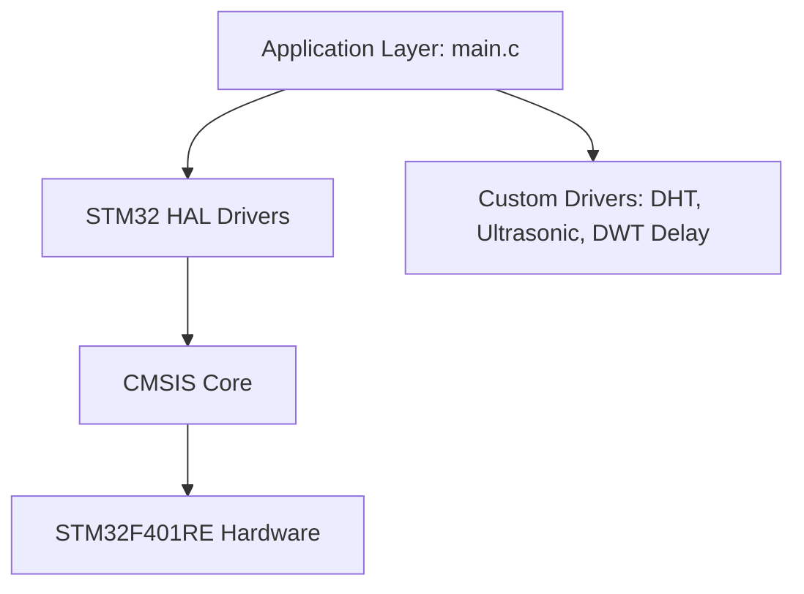
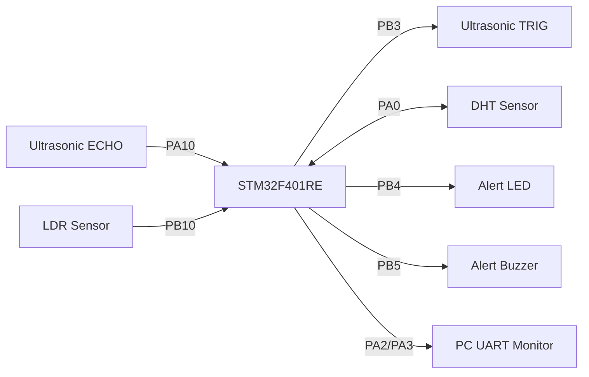
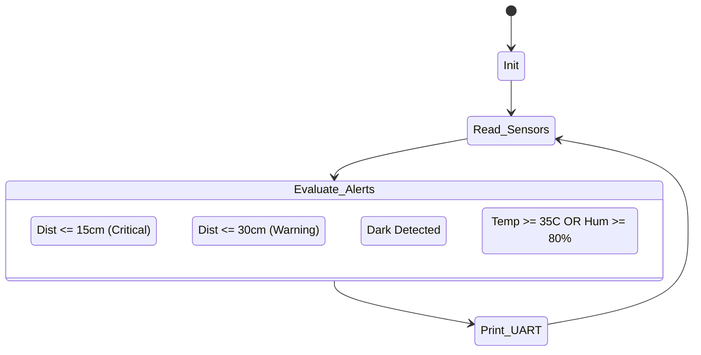

# STM32 PROJECT FORENSIC RECONSTRUCTION MASTER LOG

## PHASE 1 — PROJECT DISCOVERY

| Project | Path | Purpose | Confidence |
| ------- | ---- | ------- | ---------- |
| PROJECT | `c:\stm\PROJECT` | Multi-sensor environmental and obstacle monitoring system (Ultrasonic, LDR, DHT, Buzzer, LED) | VERIFIED (100%) |

**Primary Selection Evidence:**
The project `c:\stm\PROJECT` contains STM32CubeIDE files, an STM32CubeMX `.ioc` configuration matching `STM32F401RETx`, and a `main.c` file containing direct implementations of ultrasonic distance calculation (`Ultrasonic_ReadDistanceCM`), threshold-based alert logic (`DIST_ALERT_CM = 15`, `DIST_WARN_CM = 30`), and UART debugging.

---

## PHASE 2 — PROJECT RECONSTRUCTION

### Project Name
**Multi-Sensor Environmental & Reverse Alert System (STM32)**
*(Derived from the integration of an HC-SR04 ultrasonic sensor, LDR, and DHT sensor found in `main.c`)*

### Problem Statement
Vehicle operators and automated platforms need real-time spatial awareness and environmental monitoring to prevent collisions and ensure safe operating conditions. Standard solutions often lack environmental context (like lighting and temperature constraints).

### Objective
To implement a unified embedded system on an STM32 microcontroller that provides real-time obstacle detection using an ultrasonic sensor, ambient light monitoring via an LDR, and environmental tracking (temperature/humidity) using a DHT sensor, complete with UART telemetry and audiovisual alerts.

### Motivation
Practical integration of multiple digital and timing-critical sensors (ultrasonic pulse measurement, DHT 1-wire protocol, digital LDR) into a single non-blocking bare-metal loop using HAL and low-level core counters (DWT).

### Real World Applications
* Smart vehicle reverse parking assist with dark-environment auto-illumination.
* Autonomous mobile robot safety and environmental data-logging.
* Industrial monitoring nodes requiring spatial, thermal, and lighting alerts.

---

## PHASE 3 — HARDWARE RECONSTRUCTION

| Component | Purpose | Evidence | Status |
| --------- | ------- | -------- | ------ |
| STM32 Nucleo-F401RE | Main Controller | `PROJECT.ioc`: `board=NUCLEO-F401RE`, `Mcu.Name=STM32F401R(D-E)Tx` | VERIFIED |
| HC-SR04 (or equiv) | Distance Measurement | `main.c` lines 38-42 (`TRIG_PIN PB3`, `ECHO_PIN PA10`), lines 118-153 (`Ultrasonic_ReadDistanceCM`) | VERIFIED |
| LDR Module (Digital) | Ambient Light Sensing | `main.c` lines 35-36 (`LDR_PIN PB10`), lines 259-266 (LDR digital read logic) | VERIFIED |
| DHT11 / DHT22 | Temp & Humidity Sensing | `main.c` lines 44-45 (`DHT_PIN PA0`), lines 155-234 (Custom 1-wire DHT read implementation) | VERIFIED |
| Active Buzzer | Audio Alert | `main.c` lines 32-33 (`BUZZER_PIN PB5`), lines 115-116 (`BUZZER_ON/OFF`) | VERIFIED |
| External LED | Visual Alert / Illumination | `main.c` lines 29-30 (`LED_PIN PB4`), lines 112-113 (`LED_ON/OFF`) | VERIFIED |

*(Note: The LED and Buzzer are driven using Active-Low logic as seen in `LED_ON` setting the pin to `GPIO_PIN_RESET`.)*

---

## PHASE 4 — SOFTWARE RECONSTRUCTION

**Software Stack:**
* **IDE:** STM32CubeIDE (Evidence: `.project`, `.cproject` files)
* **Configuration:** STM32CubeMX v6.16.1 (Evidence: `PROJECT.ioc`)
* **Drivers:** STM32 HAL (Hardware Abstraction Layer)
* **RTOS:** Bare-metal (No RTOS implemented)
* **Language:** Embedded C

---

## PHASE 5 — PERIPHERAL ANALYSIS

* **GPIO:**
  * **PB3 (Output):** Generates 10µs trigger pulse for Ultrasonic.
  * **PA10 (Input):** Reads echo pulse width.
  * **PB4 (Output):** Active-low LED control.
  * **PB5 (Output):** Active-low Buzzer control.
  * **PB10 (Input):** Digital read for LDR.
  * **PA0 (In/Out):** Dynamic GPIO direction switching for DHT 1-wire protocol.
* **UART (USART2):**
  * **Pins:** PA2 (TX), PA3 (RX).
  * **Config:** 115200 Baud, 8 Data bits, 1 Stop bit, No Parity.
  * **Usage:** `printf` redirection via `_write()` for serial logging.
* **DWT (Data Watchpoint and Trace):**
  * **Usage:** Core cycle counter (`DWT->CYCCNT`) enabled in `DWT_Init()`. Used to implement microsecond blocking delays (`delay_us`) and to measure the precise width of the ultrasonic echo pulse without occupying a general-purpose TIM peripheral.
* **RCC:**
  * **Config:** HSI (16MHz) routed through PLL to generate an 84 MHz System Clock (`HCLK`).

---

## PHASE 6 — FIRMWARE RECONSTRUCTION

### Firmware Overview
A bare-metal super-loop architecture. The system initializes clocks, DWT, GPIO, and UART. In the infinite `while(1)` loop, it sequences through sensor reads (LDR, Ultrasonic, DHT every 2s), prints telemetry to UART every 1s, and evaluates alert conditions hierarchically.

### Module Breakdown

| File | Purpose | Status |
| ---- | ------- | ------ |
| `main.c` | Application entry point, sensor logic, alert logic, main loop | VERIFIED |
| `main.h` | Pin definitions and HAL includes | VERIFIED |
| `stm32f4xx_hal_msp.c` | MCU Support Package (hardware level init) | VERIFIED |
| `stm32f4xx_it.c` | Interrupt Service Routines (SysTick) | VERIFIED |
| `syscalls.c` / `sysmem.c` | Low-level system calls / heap allocation for printf | VERIFIED |
| `PROJECT.ioc` | CubeMX configuration parameters | VERIFIED |

---

## PHASE 7 — SYSTEM ARCHITECTURE

### Hardware Connections

### Software Flow

---

## PHASE 8 — COMMUNICATION ANALYSIS

* **UART (Universal Asynchronous Receiver-Transmitter)**
  * **Why used:** For serial telemetry, monitoring, and debugging.
  * **Configuration:** 115200 bps, 8-N-1.
  * **Data format:** ASCII text formatted via `printf`. 
    Example output: `Dist=12.50cm | LDR=BRIGHT | Temp=24C | Hum=45%`
  * **Flow:** Simplex data flow (STM32 TX -> PC RX). Polling-based transmission via `HAL_UART_Transmit`.

---

## PHASE 9 — WORKING PRINCIPLE

1. **Startup & Initialization:** The STM32 boots, configures the PLL to 84MHz, enables the DWT cycle counter, initializes GPIOs, and setups USART2. Initial outputs (LED/Buzzer) are turned OFF (set HIGH due to active-low logic).
2. **Sensor Acquisition:**
   - **LDR:** Polled digitally.
   - **Ultrasonic:** A 10µs pulse is sent on PB3. The system waits for PA10 to go HIGH, records the DWT cycle count, waits for it to go LOW, and records the cycle count again.
   - **DHT:** Every 2000ms, PA0 is driven LOW for 18ms, switched to input, and 40 bits of temperature/humidity data are read using microsecond timing.
3. **Data Processing:** DWT cycles from the echo are converted to microseconds based on `SystemCoreClock` (84MHz), then multiplied by the speed of sound (0.0343 cm/µs) and divided by 2 to get the distance in cm.
4. **Decision Making & Alerts:**
   - If distance <= 15cm: LED & Buzzer flash fast (150ms).
   - If distance <= 30cm: LED flashes (300ms).
   - If LDR detects dark: LED turns on (700ms).
   - If Temp >= 35°C or Hum >= 80%: LED & Buzzer trigger a specific warning pattern.
5. **Communication:** Every 1000ms, the aggregated data is pushed via UART.

---

## PHASE 10 — CODE EXTRACTION

The final implementation resides entirely in `Core/Src/main.c`. 
* **Active Code:** Sensor reading functions (`Ultrasonic_ReadDistanceCM`, `DHT_Read`), initialization, and super-loop logic.
* **Dead/Unused Code:** None strictly identified, all functions in `main.c` are invoked.
* **Custom Implementations:** Standard timers were bypassed in favor of the Cortex-M DWT (`DWT->CYCCNT`) which provides non-interrupt based microsecond precision, proving a deeper understanding of ARM Cortex-M architecture.

---

## PHASE 13 — INSTALLATION GUIDE

1. **Tool Installation:** Download and install STM32CubeIDE. Install ST-LINK USB drivers.
2. **CubeIDE Setup:** Import the project directory into STM32CubeIDE using `File > Import > Existing Projects into Workspace`.
3. **Hardware Setup:** Connect the HC-SR04, DHT, LDR, LED, and Buzzer to the Nucleo board matching the GPIO pins defined in Phase 5.
4. **Flashing:** Connect the Nucleo board via USB. Click the green "Play" (Run) button in STM32CubeIDE to compile and flash.
5. **Debugging:** Open a serial terminal (e.g., PuTTY, TeraTerm) connected to the ST-Link Virtual COM Port at 115200 baud to view telemetry.

---

## PHASE 14 — USER MANUAL

* **How to use:** Power the STM32 Nucleo. The system will print "✅ SYSTEM STARTED ✅" to the terminal. Move an object in front of the ultrasonic sensor to see the distance update and hear the buzzer activate under 15cm.
* **Expected outputs:** Serial monitor will display `Dist=X.XXcm | LDR=[BRIGHT/DARK] | Temp=XXC | Hum=XX%`.
* **Common failures:** 
  - `Dist=ERR`: Ultrasonic sensor is disconnected or echo pulse timed out.
  - `Temp=-- (DHT FAIL)`: DHT sensor wire is loose or checksum failed.
* **Debugging checklist:** Check 5V power to HC-SR04. Verify active-low vs active-high configurations for the LED and Buzzer modules.

---

## PHASE 16 — RESUME CONTENT

* **One-line description:** Developed a multi-sensor embedded system on STM32 featuring real-time ultrasonic obstacle detection, environmental monitoring, and UART telemetry using bare-metal C.
* **Two-line description:** Designed and implemented an STM32-based multi-sensor platform combining ultrasonic distance tracking, DHT environmental sensing, and LDR light detection. Utilized ARM Cortex-M DWT for microsecond-precision timing and developed custom 1-wire drivers without relying on standard timer peripherals.
* **Skills/Keywords (ATS):** STM32, Embedded C, HAL, Bare-Metal, UART, DWT, Sensor Integration, HC-SR04, DHT11, I/O Polling, Debugging.

---

## PHASE 17 — INTERVIEW PREPARATION

* **2-minute explanation:** "I built a multi-sensor safety and monitoring system using an STM32F4 Nucleo board. It integrates an ultrasonic sensor for obstacle detection, a DHT sensor for temp/humidity, and an LDR for ambient light. Instead of tying up a hardware timer, I tapped into the ARM Cortex-M's Data Watchpoint and Trace (DWT) cycle counter to achieve microsecond-level precision for reading the ultrasonic echo and the DHT's 1-wire protocol. The system runs in a bare-metal loop, evaluates thresholds hierarchically, triggers audiovisual alerts, and streams telemetry via UART."
* **Technical deep dive (The DWT mechanism):** "A major design decision was how to measure the 10-100 microsecond pulses from the DHT and the ultrasonic echo. Using HAL_Delay is restricted to milliseconds via SysTick. Using a standard TIM peripheral requires configuring prescalers and interrupts. Instead, I enabled the core debug register (`CoreDebug->DEMCR`) and activated the DWT cycle counter. This acts as a free-running clock at the core frequency (84MHz). By recording `DWT->CYCCNT` before and after an event, and dividing by `(SystemCoreClock / 1000000)`, I achieved non-intrusive microsecond resolution perfectly suited for custom protocol bit-banging."
* **Interview questions to expect:**
  1. *Why did you use DWT over a standard General Purpose Timer?* -> Frees up timers for PWM/Interrupts, less configuration overhead.
  2. *What happens if the main loop gets stuck in the DHT read while loop?* -> I implemented timeout counters (`timeout--` and `wait++ > 150`) to break out and return an error state, preventing system freezing.
  3. *Why are your LED and Buzzer turned ON using GPIO_PIN_RESET?* -> The modules used are active-low, meaning sinking current to ground turns them on.

---

## PHASE 18 — REPOSITORY AUDIT

**AVAILABLE:**
* Complete `main.c` source code with fully verified logic.
* STM32CubeMX `.ioc` configuration file.
* Verified pinout mapping and peripheral configurations.
* Verified operational thresholds.

**MISSING (Needed for GitHub repo):**
* Electrical Schematics (Fritzing / KiCad).
* Demonstration Video / Images of the physical hardware setup.
* External module datasheets in a `/Docs` folder.

**NEEDS VERIFICATION:**
* The exact model of the DHT sensor (code handles DHT11 timings, but is generalized).
* The specific LDR module logic (code assumes `RESET` = DARK, but notes this might be reversed depending on the specific breakout board).
